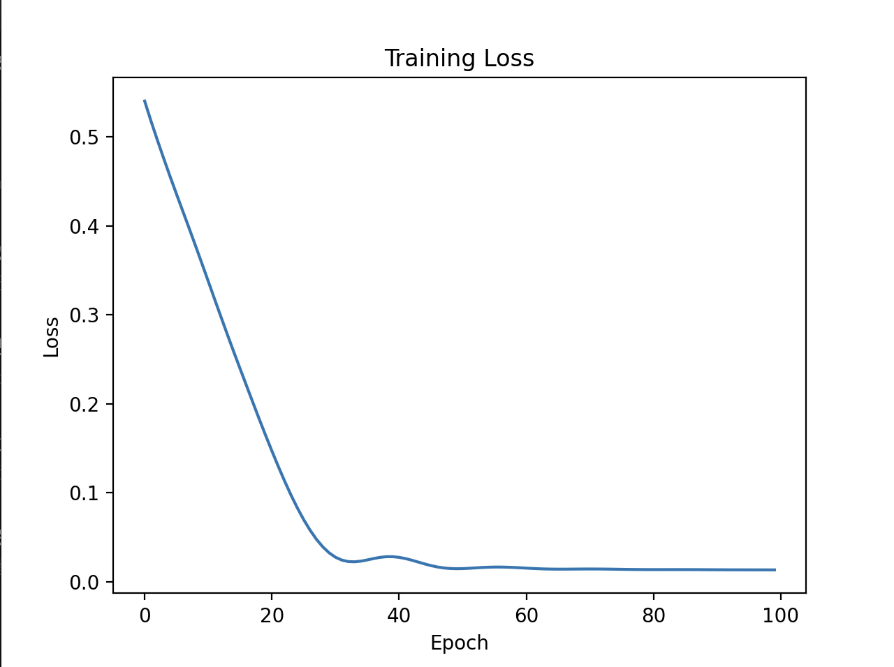

# Pytorch, 神经网络与我们在期待什么   
## Section 01：基调   
1. 降低预期，本章不是你获得神经网络相关知识的地点。实际上，这个领域发展的如此迅猛，3~5年之前的论文就被打上”上古“标签，像我等只是借用模型在本领域进行应用的场景下，是否有资格做任何判断本身就存疑。   
2. 个人能支持的网络规模虽然有限，但基于领域知识的拆分目前评估也足够应用出彩。所以也不一定要妄自菲薄，觉得已经无能为力。相反的，大模型真的第一次让我能如此高效的在这个细分领域做的更多。   
3. GPU算的快是事实，但那是你花钱买它的那一刻就预期到的事情。对于应用GPU的工具价值的预期(快速的前提下，尽量的准确，更优的结果与更便捷的模块调用)却来自于程序员和工具使用者的领域知识。   
   
## Section 02：可能存在争议的个人判断   
非专职该领域学术研究，应用模型的高投入产出方案是什么？   
1. 宏观入手，微观放弃：将量化的问题去套机器学习划分好的场景，比如是个回归问题还是个分类问题？是否采用增强学习的框架？模型层面选择哪种更合理？这些可能都已经相当挑战，就不要去死磕是不是自己发明的有比adam更牛逼的optimizer。   
2. 量化领域应用时，越远离围绕价格的点值预测可能阻力越小。这与金融分析的领域知识有关，所以也是见仁见智。   
3. 专注领域知识深入，微小的模型只解决单一简单问题。神经网络模型有个特点，很多应用场景实际上模型自身的变化并不大，反倒是数据层面的处理赋予了其相关的意义。这就引出了两个思考方向：   
    > 待处理的问题固定，用什么模型工具合适   

    举例来说，一个简单的线性回归问题，其实可以用标准的FC来处理，也可以用RL方式来处理，以下为代码例子。比较来看，RL的具体模型与FC都是一致的，仅仅是训练更新机制中存在不同。从结果来看，两边都可以解决这个问题, 普通的全连接网络（FC）损失下降很快。强化学习中的网络则需要通过环境的反馈逐步调整，学习过程较为缓慢。   
    |                                                                                                                                                                                                                                                                                                                                                                                           FC model |                                                                                                                                                                                                                                                                                                                                                                                          DQN model |
    |:---------------------------------------------------------------------------------------------------------------------------------------------------------------------------------------------------------------------------------------------------------------------------------------------------------------------------------------------------------------------------------------------------|:---------------------------------------------------------------------------------------------------------------------------------------------------------------------------------------------------------------------------------------------------------------------------------------------------------------------------------------------------------------------------------------------------|
    | Epoch 0, Loss: 132.7027587890625 Epoch 100, Loss: 0.015572714619338512 Epoch 200, Loss: 0.00017316047160420567 Epoch 300, Loss: 7.045352685963735e-05 Epoch 400, Loss: 4.023780275019817e-05 Epoch 500, Loss: 2.6890053050010465e-05 Epoch 600, Loss: 1.8399234249955043e-05 Epoch 700, Loss: 1.1512761375342961e-05 Epoch 800, Loss: 6.998458047746681e-06 Epoch 900, Loss: 4.500810973695479e-06 | Epoch 0, Loss: 144.50608825683594 Epoch 100, Loss: 0.027036404237151146 Epoch 200, Loss: 0.0019762783776968718 Epoch 300, Loss: 0.00021854773513041437 Epoch 400, Loss: 8.594315295340493e-05 Epoch 500, Loss: 5.9787387726828456e-05 Epoch 600, Loss: 4.43860626546666e-05 Epoch 700, Loss: 3.4103391953976825e-05 Epoch 800, Loss: 2.7173697162652388e-05 Epoch 900, Loss: 2.242411756014917e-05 |

    ```
# DQN.py model

import torch
import torch.nn as nn
import torch.optim as optim
import numpy as np
import matplotlib.pyplot as plt

# 生成数据
x = np.linspace(-10, 10, 100).reshape(-1, 1)
y = 2 * x + 3  # 目标函数

# 转换为 PyTorch 张量
x_train = torch.FloatTensor(x)
y_train = torch.FloatTensor(y)

# 定义一个简单的全连接网络
class SimpleFC(nn.Module):
    def __init__(self):
        super(SimpleFC, self).__init__()
        self.fc1 = nn.Linear(1, 64)
        self.fc2 = nn.Linear(64, 64)
        self.fc3 = nn.Linear(64, 1)
    
    def forward(self, x):
        x = torch.relu(self.fc1(x))
        x = torch.relu(self.fc2(x))
        return self.fc3(x)

# 初始化模型、损失函数和优化器
model = SimpleFC()
criterion = nn.MSELoss()
optimizer = optim.Adam(model.parameters(), lr=0.01)

# 训练网络
epochs = 1000
losses = []
for epoch in range(epochs):
    model.train()
    optimizer.zero_grad()
    output = model(x_train)
    loss = criterion(output, y_train)
    loss.backward()
    optimizer.step()
    losses.append(loss.item())
    if epoch % 100 == 0:
        print(f"Epoch {epoch}, Loss: {loss.item()}")

# 可视化结果
model.eval()
predicted = model(x_train).detach().numpy()

plt.plot(x, y, label='True')
plt.plot(x, predicted, label='Predicted')
plt.legend()
plt.show()
```
    ```
# FC.py model

import torch
import torch.nn as nn
import torch.optim as optim
import numpy as np
import matplotlib.pyplot as plt

# 生成数据
x = np.linspace(-10, 10, 100).reshape(-1, 1)
y = 2 * x + 3  # 目标函数

# 转换为 PyTorch 张量
x_train = torch.FloatTensor(x)
y_train = torch.FloatTensor(y)

# 定义一个简单的全连接网络
class SimpleFC(nn.Module):
    def __init__(self):
        super(SimpleFC, self).__init__()
        self.fc1 = nn.Linear(1, 64)
        self.fc2 = nn.Linear(64, 64)
        self.fc3 = nn.Linear(64, 1)
    
    def forward(self, x):
        x = torch.relu(self.fc1(x))
        x = torch.relu(self.fc2(x))
        return self.fc3(x)

# 初始化模型、损失函数和优化器
model = SimpleFC()
criterion = nn.MSELoss()
optimizer = optim.Adam(model.parameters(), lr=0.01)

# 训练网络
epochs = 1000
losses = []
for epoch in range(epochs):
    model.train()
    optimizer.zero_grad()
    output = model(x_train)
    loss = criterion(output, y_train)
    loss.backward()
    optimizer.step()
    losses.append(loss.item())
    if epoch % 100 == 0:
        print(f"Epoch {epoch}, Loss: {loss.item()}")

# 可视化结果
model.eval()
predicted = model(x_train).detach().numpy()

plt.plot(x, y, label='True')
plt.plot(x, predicted, label='Predicted')
plt.legend()
plt.show()
```
    > 模型工具固定，怎么调整待处理的问题   

    1-D CNN在金融时序数据的应用。此处纯粹是因为想要使用1-D CNN，所以用过去的时序数据来充当输入的信息。这里的问题在于两个方面：   
    - Conv1D自身是不知道数据自身的序列属性。这实际上是使用者人工赋予的数据挖掘方向。其实如果具备，用其他的信息可能更为合理。但举例子就不要太纠结了。   
    - pytorch实际上在网络层级上给了很多预设的layer，如果存在就直接用就好，它大概率比你自己做的自定义相关实现有更好的优化表现。如果没有再考虑是不是要自定义实现相关机制。   
        - 实际上如果真的没有，第一个直觉就是”是不是这个领域有其他的更好的模型出现了？”这个领域的知识更新速度太快了，就好像RNN模型在大范围的被self-attention替代一样，我们这种非该领域专职研究员有所遗漏再正常不过了。   
   
    唯一需要留意的就是不同类型的网络输入的数据的差异   
      举例来说：   
      RNN的模型input可能是**(sequence\_length, batch\_size, num\_features)** or **(batch\_size, sequence\_length, num\_features)**   
      FC的模型input可能是**(batch\_size, num\_features)**   
      Conv1d的模型input可能是**(batch\_size, in\_channels, seq\_length)**   
      Conv1d接FC要展开其输出以适配FC的输入道理类似，这个地方留意一下容易出问题。   
      ```
import torch
import torch.nn as nn
import torch.optim as optim
import numpy as np
import matplotlib.pyplot as plt

# 1. 生成示例数据
def generate_data(seq_length, n_samples):
    np.random.seed(42)
    x = np.linspace(0, 100, n_samples)
    y = np.sin(x) + np.random.normal(0, 0.1, n_samples)  # 添加噪声的价格数据
    data = []
    for i in range(len(x) - seq_length):
        data.append(y[i:i + seq_length])
    return np.array(data), y[seq_length:]

seq_length = 5
n_samples = 200
X, y = generate_data(seq_length, n_samples)

# 2. 数据预处理并转换为PyTorch张量
X_train = torch.FloatTensor(X).unsqueeze(1)  # (batch_size, 1, seq_length)
y_train = torch.FloatTensor(y).unsqueeze(-1)  # (batch_size, 1)

# 3. 定义1D CNN模型
class CNN1DTimeSeries(nn.Module):
    def __init__(self):
        super(CNN1DTimeSeries, self).__init__()
        self.conv1 = nn.Conv1d(in_channels=1, out_channels=16, kernel_size=2)  # Conv1D层
        self.conv2 = nn.Conv1d(in_channels=16, out_channels=32, kernel_size=2)
        
        # 计算全连接层输入大小
        self.flatten_size = self._get_conv_output_shape()

        self.fc1 = nn.Linear(self.flatten_size, 50)  # 全连接层1
        self.fc2 = nn.Linear(50, 1)  # 最终输出为单一价格预测

    def _get_conv_output_shape(self):
        # 用随机张量推导卷积层的输出形状
        with torch.no_grad():
            x = torch.zeros(1, 1, seq_length)  # (batch_size=1, in_channels=1, seq_length)
            x = torch.relu(self.conv1(x))
            x = torch.relu(self.conv2(x))
            return x.numel()  # 计算展平后的元素数量

    def forward(self, x):
        x = torch.relu(self.conv1(x))  # 卷积1
        x = torch.relu(self.conv2(x))  # 卷积2
        x = x.view(x.size(0), -1)  # 展平
        x = torch.relu(self.fc1(x))  # 全连接层1
        return self.fc2(x)  # 输出层

# 4. 初始化模型、损失函数和优化器
model = CNN1DTimeSeries()
criterion = nn.MSELoss()
optimizer = optim.Adam(model.parameters(), lr=0.001)

# 5. 训练模型
epochs = 100
losses = []
for epoch in range(epochs):
    model.train()
    optimizer.zero_grad()
    
    output = model(X_train)
    loss = criterion(output, y_train)
    loss.backward()
    optimizer.step()
    
    losses.append(loss.item())
    if epoch % 10 == 0:
        print(f'Epoch {epoch}, Loss: {loss.item()}')

# 6. 绘制训练损失曲线
plt.plot(losses)
plt.title('Training Loss')
plt.xlabel('Epoch')
plt.ylabel('Loss')
plt.show()

# 7. 测试模型并可视化结果
model.eval()
predicted = model(X_train).detach().numpy()

# 8. 可视化实际价格与预测价格
plt.plot(y, label='True Prices')
plt.plot(predicted, label='Predicted Prices')
plt.legend()
plt.show()

# Epoch 0, Loss: 0.5234584212303162
# Epoch 10, Loss: 0.37698492407798767
# Epoch 20, Loss: 0.19763697683811188
# Epoch 30, Loss: 0.0395878367125988
# Epoch 40, Loss: 0.0300571471452713
# Epoch 50, Loss: 0.015313473530113697
# Epoch 60, Loss: 0.015903208404779434
# Epoch 70, Loss: 0.013504610396921635
# Epoch 80, Loss: 0.013377712108194828
# Epoch 90, Loss: 0.013072483241558075

```
          
       
    说不出原因，我个人更喜欢GAN类型的网络，有一种变态的快乐，就是没太想好应用场景😅   
4. 大模型虽然不能面面具备，但显然留给普通人的时间不多了。当进行表达式生成问题的时候，本文实际上想做一个基于Karva Expression的神经网络生成的案例以对比GEP。GPT-4o本身了解这一概念，但是做的并不好。提供文献参考后，显然能做的更多，甚至也提出了使用transformer进行生成的方案，但生成过程伴随着长时间的表达式解析异常。究其原因，是KE的尾部的非算子特征始终被大模型忽略。或许再大力一点就会出奇迹，毕竟我的Mac还是有点性能提升空间。但可能下一个版本的大语言模型，这个问题就可以通过修正生成函数而得到彻底解决。所以，或许未来真的会成为一个需要对自身领域足够了解，涉猎广泛能发现痛点并提出技术改进痛点的“天命人”才会得以生存吧。   
   
## Section 03：合理预期   
1. 或许这目前仍然不是一个可以完全被大模型碾压的领域，但专业领域知识的护城河确实越来越小，伴随着辅助工具的不断完善，分析师的工作价值将越来越低。   
2. 一个良好的机制不断地产生符合要求的策略实例任务。   
3. 神经网络这个领域过于庞大，投入多少时间都不可能完备。如果有其他框架级别的重要事项，应该先完成其他，然后再谈论本处。当然，TA的优先级定位在我们所说的量化分析框架里目前充当的函数搜索的作用不是唯一备选有关系。   
   
##    
   
